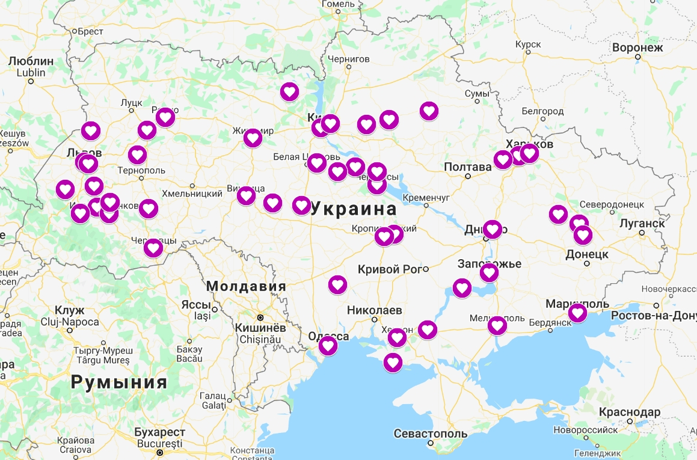

# Личный проект

- Студентка: Гордеева Юлия
- Группа: Web-20-2
- Форма обучения: очно
- Версия 1-я, 2021 г

## О проекте

### Идея проекта

В Украине есть около сотни семей (на самом деле их больше), у которых есть дети/родные, страдающие орфанным заболеванием - мукополисахаридоз (МПС). Родители, которые впервые сталкиваются с этим диагнозом, услышав неутешительные прогнозы врачей,не знают как им жить дальше, что делать и как с этим бороться. Начинают искать информацию в Интернете. Информации мало, она сухая, общая и не очень обнадеживающая. Приходится выискивать отдельные случаи, искать такие же семьи, чтобы понимать как бороться с болезнью и жить дальше.
Для объединения таких семей была создана сначала группа в Вконтакте, позже в Facebook. Группа является закрытой, в ней люди могут общаться, обсуждать свои проблемы, обмениваться опытом, спрашивать советов у врачей. Но далеко не все и не сразу могут найти эту группу. В свободном доступе информации о жизни с мукополисахаридозом в Украине мало, она разбросана.
Давно назрела необходимость создания отдельного сайта "Мукополисахаридоз в Украине", на котором будет собрана вся полезная информация, это:
- статьи из интернет-изданий с историями семей, у которых есть родные с МПС (а таких собралось уже некоторое количество);
- видео-репортажи о детях и взрослых с МПС, истории их борьбы с болезнью, истории их успехов;
- посты родителей о свои детях;
- буклеты с описанием типов МПСов (их 7) - они нужны для информирования врачей и родных пациентов. Часто врачи вне крупных городов не знают диагноза МПС и не знают как вести таких пациентов на местах. Для этих целей были созданы буклеты, в которых собрана вся необходимая медицинская информация;
- медицинские протоколы ведения пациентов с МПС (часто врачи не знают, что такие протоколы есть);
- информация о реабилитации и технических средствах реабилитации для пациентов с МПС;
- информационные объявления о периодически проводимых МПС-съездах, онлайн-встречах. На таких встречах семьи собираются, обмениваются опытом, общаются с мультидисциплинарной группой врачей Киевского ОХМАТДЕТа;
- презентации врачей всех направленностей о путях решения проблем, связанных с МПС;
- способы лечения разных типов МПС, клинические испытания, проводимые в мире для лечения МПСа, поддержка пациентов с МПС, которые не получают лечения, паллиативная поддержка и помощь.
- информация о том, в какие именно больницы Украины можно обратиться для подтверждения диагноза, дальнейшего лечения и ведения.

На самом деле информации много, но, уже исходя их того, что я вижу в группе в Facebook, я понимаю, что многие люди просто не умеют ее искать. Тяжело искать ее даже в самой группе в Facebook, где лента постоянно обновляется и данные теряются. Поэтому было бы замечательно, если бы впервые столкнувшиеся с диагнозом "мукополисахаридоз" люди могли загуглить, найти сайт и получить оттуда всю полезную и актуальную информацию, контакты, ссылки на группу и пр. Это было бы огромной моральной поддержкой, в которой "новички" всегда остро нуждаются дабы не опускать руки и понимать, что с этим диагнозом не только можно жить, но и часто жить качественно и полноценно, не теряя надежды.

Много букв и огромная задумка, но конечно же в своем проекте сразу все я не успела реализовать :sweat_smile:

### Что реализовано в проекте:
Реализовано SPA-приложение с возможностью авторизации и аутентификации. Главная странница сайта содержит удобную навигацию по разделам, также здесь представлена реальная контактная информация, информация о партнерах - благотворительных фондах и фарм-компаниях.
Создана база данных для сбора и отображения на сайте следующей информации:
- новости (самые важные посты, которые публикуются в группе);
- статьи из интернет-изданий;
- видео-репортажи о пациентах с МПС;
- раздел с описанием и перечислением всех типов мукополисахаридоза + буклеты и медицинские протоколы по типам;
- раздел "Наши дети" (минимальная версия)
- слайдер с информация о врачах, которые ведут пациентов с МПС.

  (вся информация реальная)

Реализована возможность добавления, редактирования и удаления администратором постов, статей и видео. На главной странице отображается по 3 "топовых" поста, статьи, видео. Отсюда можно перейти в разделы с более полной информацией.
Есть раздел "Типы МПС", в котором из БД выводится список с описанием каждого типа + ссылки на буклеты с описанием каждого типа, ссылки на медицинские протоколы лечения, ссылка на буклет об анестезии для МПС-пациентов. Сами буклет и протоколы хранятся на google-аккаунте MPSinUkraine
(mpsinua2021@gmail.com). Видео-материалы, представленные в проекте, собраны на youtube-канале этого же аккаунта.

## Как развернуть проект

    git clone https://github.com/jgordaja/mpsinukraine.ua.git
    cd mpsinukraine.ua
    composer install
    php artisan key:generate
    php artisan session:table
    php artisan migrate
    php artisan db:seed
    php artisan storage:link
    php artisan passport:install
    npm i
    npm run dev

Права администратора имеет пользователь, роль которого 'admin' (изменить роль для зарегистрированного пользователя в БД) 
